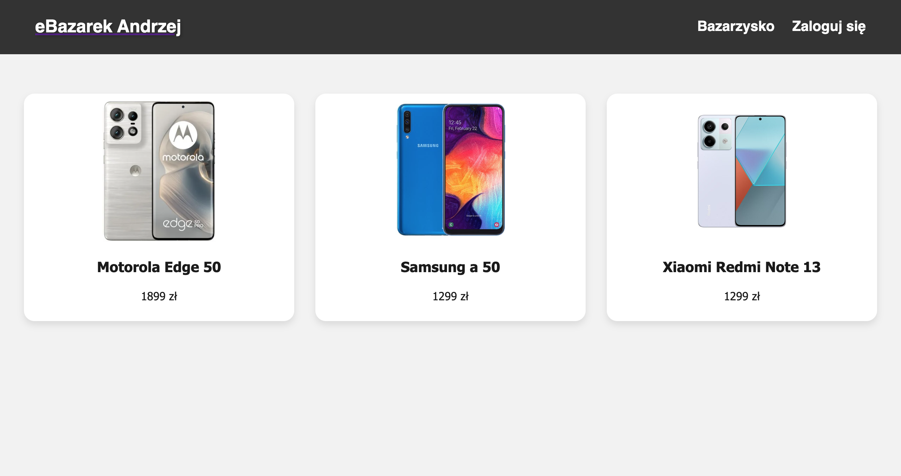
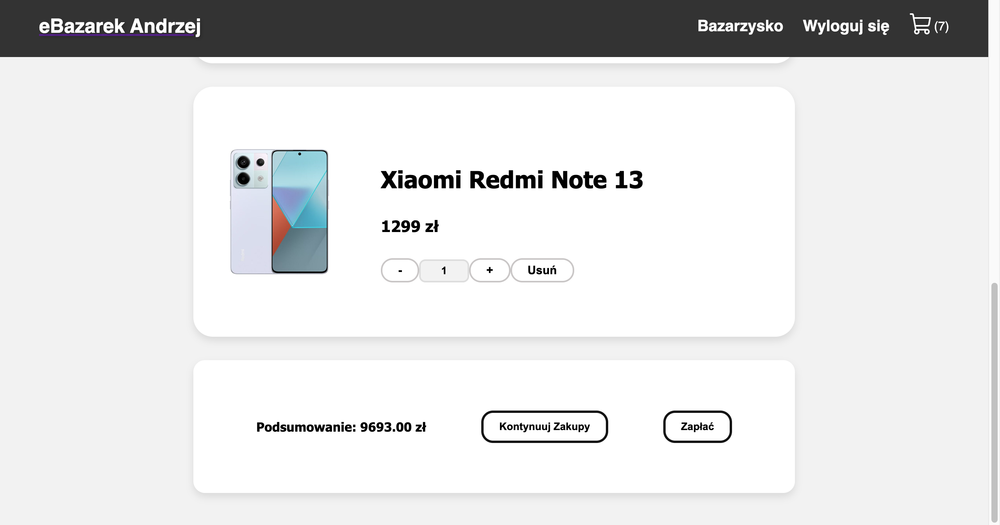
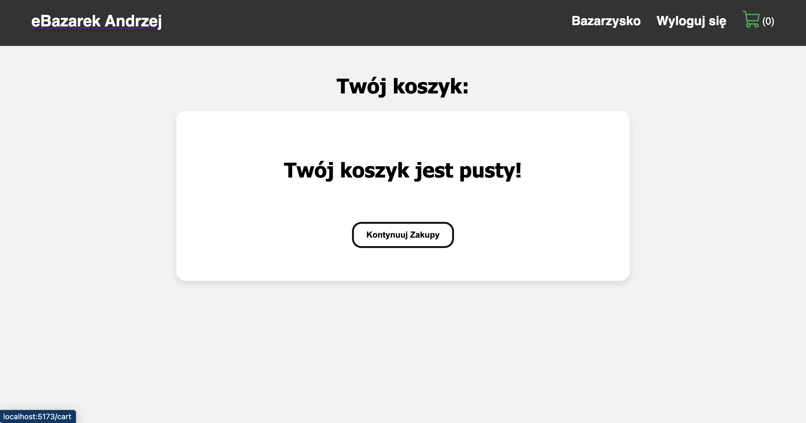

# BD2 mini projekt - sklep internetowy

Skład grupy (imiona i nazwiska, adresy email):

- Bartłomiej Szubiak bszubiak@student.agh.edu.pl
- Szymon Kubiczek kubiczek@student.agh.edu.pl
- Konrad Armatys karmatys@student.agh.edu.pl

Temat (tytuł) projektu: Sklep internetowy

Informacje o wykorzystywanym SZBD i technologii realizacji projektu

- baza danych: `MongoDB`
- backend: `Node.js` , `Express.js`
- frameworki\middleware dla backend'u: `mongoose` , `multer` , `cors`
- frontend: `React`

(Link do repozytorium)[https://github.com/Simsoftcik/BD2Projekt]

## Opis bazy danych

Baza ma implementować prosty sklep internetowy, w tym celu korzystamy z mongoDB.

### Kolekcje

Poniżej został pokazane przykładowe dokumenty dla każdej z kolekcji.

#### Kolekcja users

```js
{
	_id: 0,
	customerData: {
		firstName: "Jan",
		lastName: "Kowalski",
		phone: "123456789",
		adress:{
			country: "Poland",
			postalCode: "12-345",
			region: "Śląsk",
			city: "Katowice",
			street: "Mariacka",
			buildingNumber: "9",
			apartmentNumber: ""
		}
	},
	login: "janekjanek",
	email: "janekjanek@gmail.com",
	password: hashedPassword,
	cartData: [
		{
			productId: 4,
			quantity: 8
		},
	]
	orders: [{
		_id:0,
		date: new Date("2024-05-12"),
		paymentStatus: "confirmed",
		products: [
			{
				productId: 1,
				quantity: 5
			},
			{
				productId: 10,
				quantity: 1
			},
		],
		totalPrice: 100
	}]
}

```

#### Kolekcja products

```js
{
	_id: 10,
	name: "motorola moto g60",
	quantity: 15,
	price: 900.00,
	productDetails: {
		mainDescription: "Telefon jakich mało",
		paragraphDescription: "Dobra bateria, 128GB pamięci...",
	}
	imageUrl: "urlDoZdjęcia",
	available: true
}
```

#### Kolekcja salesHistory

```js
{
	productId: 10,
	quantity: 5,
	date: new Date("2024-05-12"),
	price: 10.00
}
```

### Charakterystyka bazy

Baza danych pozwala na łatwe odczytanie historii produktu oraz historii klienta kosztem pamięci jednego dokumentu.

Baza danych jest łatwa w modyfikowaniu i utrzymywaniu w przyszłości.

## Modele

By zapewnić jednolitą postać danych w bazie danych, zaprojektowaliśmy modele, korzystając z biblioteki Mongoose.

### ProductSchema (kolekcja products)

```js
name: `String`, required, unique
quantity: `Number`, required
price: `Number`, required
productDetails: required
	mainDescription: `String`, required, maxLength=100
	paragraphDescription: `String`, required, maxLength=100
imageUrl: `String`, required
available: `Boolean`, default=true
```

### UserSchema (kolekcja users)

```js
customerData:
	firstName: `String`, maxLength=50
	lastName: `String`, maxLength=50
	phone: `String`
	adress:
		country: `String`, maxLength=50
		postalCode: `String`, maxLength=50
		region: `String`, maxLength=50
		city: `String`, maxLength=50
		street: `String`, maxLength=50
		buildingNumber: `String`, maxLength=50
		apartmentNumber: `String`, maxLength=50
login: `String`, required, unique
email: `String`, required, unique
password: `String`, required
[cartData]: default=[]
  productId: `ObjectId`, required
  quantity: `Number`, required, min=1
[orders]: default=[]
  date: `Date`, required, default=Date.now()
    paymentStatus: `String`, required, enum=['Paid', 'Pending', 'Failed']
    products: required
      productId: `ObjectId`, required
    quantity: `Number`, required, min=1
  totalPrice: `Number`
```

### SalesHistorySchema (kolekcja salesHistory)

```js
productId: `ObjectId`, required
quantity: `Number`, required, default=1
date: `Date`, required, default=Date.now(), index
price: `Number`, required
```

### Walidacja

Wszędzie gdzie było to potrzebne, wyposażaliśmy modele w funkcje walidujące dane. W przypadku emaila, phone, year, month sprawdzały one dodatkowo zgodność z ustalonymi wyrażeniami regularnymi

## Endpointy

### Endpointy koszyka

Każda metoda opisana poniżej korzysta z middleware findUser,
który weryfikuje czy użytkownik istnieje i czy podany przez niego token jest poprawny.

#### /cart/own

##### Opis

Zwraca koszyk klienta.

##### Metoda HTTP `GET`

##### Parametry

- \_id `ObjectId`

##### Wartość zwracana

```js
{
  success: true,
  cartData: CartItemSchema[]
}
```

##### Zwracanie błędu

```js
{
  success: false,
  message: string,
  errors: string
}
```

#### /cart/updateone

##### Opis

Zmienia dane jednego produktu w koszyku użytkownika.

##### Metoda HTTP `POST`

##### Parametry

- \_id `ObjectId`
- cartProductData `CartItemSchema`

##### Wartość zwracana

```js
{
  success: true,
  message: 'Cart updated',
  newCart: {
    type: [CartItemSchema],
    default: []
  },
  oldCart: {
    type: [CartItemSchema],
    default: []
  }
}
```

##### Zwracanie błędu

```js
{
  success: false,
  message: string,
  errors: string
}
```

#### /cart/sell

##### Opis

Sprzedaje produkty użytkownikowi z jego koszyka.

---

Aby zachować synchroniczność dostępu do danych używamy mutexa weryfikacyjnego.

##### Metoda HTTP `POST`

##### Parametry

- \_id `ObjectId`

##### Wartość zwracana

```js
{
  success: true,
  message: 'Products sold',
  totalPrice: number
}
```

##### Zwracanie błędu

```js
{
  success: false,
  message: string,
  errors: string,
  newCart: {
    type: [CartItemSchema],
    default: []
  },
  oldCart: {
    type: [CartItemSchema],
    default: []
  }
}
```

### Endpointy produktu

#### /products/list

##### Opis

Zwraca wszystkie produkty.

##### Metoda HTTP `GET`

##### Parametry

- \_id `ObjectId`

##### Wartość zwracana

```js
{
  success: true,
  cartData: CartItemSchema[]
}
```

##### Zwracanie błędu

```js
{
  success: false,
  message: string,
  errors: string
}
```

#### /products/available

##### Opis

Zwraca wszystkie dostępne produkty.

##### Metoda HTTP `GET`

##### Parametry

- \_id `ObjectId`

##### Wartość zwracana

```js
{
  success: true,
  cartData: CartItemSchema[]
}
```

##### Zwracanie błędu

```js
{
  success: false,
  message: string,
  errors: string
}
```

#### /products/add

##### Opis

Dodaje nowy produkt.

---

Przed wykonaniem sprawdzamy przy pomocy middlewaru validateBodyJsonSchema czy dane nowego produktu są poprawne.

##### Metoda HTTP `POST`

##### Parametry

- \_id `ObjectId`
- newProduct `productSchema`

##### Wartość zwracana

```js
{
  success: true,
  message: 'Product saved',
  name: string
}
```

##### Zwracanie błędu

```js
{
  success: false,
  message: string,
  errors: string
}
```

#### /products/get/:id

##### Opis

Dodaje nowy produkt.

---

Przed wykonaniem sprawdzamy przy pomocy middlewaru validateBodyJsonSchema czy dane nowego produktu są poprawne.

##### Metoda HTTP `GET`

##### Parametry

- \_id `ObjectId`
- _optional_ projection `Projection`

##### Wartość zwracana

```js
{
  success: true,
  product: {
    _id: ObjectId,
    name: string,
    quantity: number,
    price: number,
    productDetails: {
      mainDescription: string,
      paragraphDescription: string,
    },
    imageUrl: string,
    available: boolean,
  }
}
```

---

Wartość zwracana jest zależna od projection.
Powyżej znajdują się dane otrzymane gdy projection nie zostanie podane.

##### Zwracanie błędu

```js
{
  success: false,
  message: string,
  errors: string
}
```

### Endpointy użytkownika

#### /users/list

##### Opis

Zwraca wszystkich użytkowników.

##### Metoda HTTP `GET`

##### Parametry

- _optional_ projection `Projection`
- _optional_ filter `Filter`

##### Wartość zwracana

```js
{
  success: true,
  products: [
    {
      _id: ObjectId,
      customerData: {
        firstName: string,
        lastName: string,
        phone: string,
        adress: {
          country: string,
          postalCode: string,
          region: string,
          city: string,
          street: string,
          buildingNumber: string,
          apartmentNumber: string
        }
      },
      login: string,
      email: string,
      password: encodedPassword,
      cartData: {
        productId: number
        quantity: number
      }
      orders: {
        _id: ObjectId,
        date: Date,
        paymentStatus: string,
        products: [
          {
            productId: number,
            quantity: number
          },
          {
            productId: number,
            quantity: number
          },
        ],
        totalPrice: number
      }
    }
  ]
}
```

---

Wartość zwracana jest zależna od projection.
Powyżej znajdują się dane otrzymane gdy projection nie zostanie podane.

##### Zwracanie błędu

```js
{
  success: false,
  message: string,
  errors: string
}
```

#### /users/add

##### Opis

Dodaje nowego użytkownika.

##### Metoda HTTP `POST`

##### Parametry

- user `UserSchema`

##### Wartość zwracana

```js
{
  success: true,
  message: 'User has been created',
  user: {
    _id: ObjectId,
    customerData: {
      firstName: string,
      lastName: string,
      phone: string,
      adress: {
        country: string,
        postalCode: string,
        region: string,
        city: string,
        street: string,
        buildingNumber: string,
        apartmentNumber: string
      }
    },
    login: string,
    email: string,
    password: encodedPassword,
    cartData: {
      productId: number
      quantity: number
    }
    orders: {
      _id: ObjectId,
      date: Date,
      paymentStatus: string,
      products: [
        {
          productId: number,
          quantity: number
        },
        {
          productId: number,
          quantity: number
        },
      ],
      totalPrice: number
    }
  }
}
```

##### Zwracanie błędu

```js
{
  success: false,
  message: string,
  errors: string
}
```

#### /users/signup

##### Opis

Rejestruje nowego użytkownika.

##### Metoda HTTP `POST`

##### Parametry

- user `UserSchema`

##### Wartość zwracana

```js
{
  success: true,
  token: token,
  user: {
    _id: ObjectId,
    login: string,
    email: string
  }
}
```

##### Zwracanie błędu

```js
{
  success: false,
  message: string,
  errors: string
}
```

#### /users/login

##### Opis

Loguje użytkownika.

##### Metoda HTTP `POST`

##### Parametry

- user `UserSchema`

##### Wartość zwracana

```js
{
  success: true,
  token: token,
  user: {
    _id: ObjectId,
    login: string,
    email: string
  }
}
```

##### Zwracanie błędu

```js
{
  success: false,
  message: string,
  errors: string
}
```

## Metody pomocnicze

#### addNewUser

##### Opis

Dodaje użytkownika do bazy.

##### Parametry

- userData `UserSchema`

##### Wartość zwracana

```js
{
  success: true,
  message: 'User has been created',
  user: {
    _id: ObjectId,
    customerData: {
      firstName: string,
      lastName: string,
      phone: string,
      adress: {
        country: string,
        postalCode: string,
        region: string,
        city: string,
        street: string,
        buildingNumber: string,
        apartmentNumber: string
      }
    },
    login: string,
    email: string,
    password: encodedPassword,
    cartData: {
      productId: number
      quantity: number
    }
    orders: {
      _id: ObjectId,
      date: Date,
      paymentStatus: string,
      products: [
        {
          productId: number,
          quantity: number
        },
        {
          productId: number,
          quantity: number
        },
      ],
      totalPrice: number
    }
  }
}
```

##### Zwracanie błędu

```js
{
  success: false,
  message: string,
  errors: string
}
```

#### getUserToken

##### Opis

Generuje token użytkownikowi.

##### Parametry

- user `UserSchema`

##### Wartość zwracana

`string`

#### getUserByToken

##### Opis

Zwraca użytkownika na podstawie tokenu.

##### Parametry

- token `string`

##### Wartość zwracana

```js
{
  _id: ObjectId,
  customerData: {
    firstName: string,
    lastName: string,
    phone: string,
    adress: {
      country: string,
      postalCode: string,
      region: string,
      city: string,
      street: string,
      buildingNumber: string,
      apartmentNumber: string
    }
  },
  login: string,
  email: string,
  password: encodedPassword,
  cartData: {
    productId: number
    quantity: number
  }
  orders: {
    _id: ObjectId,
    date: Date,
    paymentStatus: string,
    products: [
      {
        productId: number,
        quantity: number
      },
      {
        productId: number,
        quantity: number
      },
    ],
    totalPrice: number
  }
}
```

#### findUser

##### Opis

Sprawdza czy użytkownik istnieje w bazie i czy jego token jest poprawny.

##### Parametry

- req `Request`
- res `Response`
- next `Function`

##### Wartość zwracana

`undefined`

##### Zwracanie błędu

```js
{
  success: false,
  message: string,
  errors: string
}
```

#### verifyCart

##### Opis

Sprawdza czy koszyk jest poprawny.

##### Parametry

- cartData `CartItemSchema[]`

##### Wartość zwracana

```js
{
  fixedCart: [
    {
      productId: number,
      quantity: number
    }
  ],
  cartError: false
}
```

##### Zwracanie błędu

```js
{
  fixedCart: [
    {
      productId: number,
      quantity: number
    }
  ],
  cartError: true
}
```

#### validateBodyJsonSchema

##### Opis

Middleware który sprawdza czy request.body posiada daną strukturę.

##### Parametry

- bodyFieldName `string`
- schema `Function`

##### Wartość zwracana

`undefined`

##### Zwracanie błędu

```js
{
  success: false,
  message: string,
  errors: string
}
```
~
## Frontend

Przy pomocy biblioteki React stworzyliśmy dwie strony internetowe- jedną dla uzytkownika, która pobiera dane z endpointów i umożliwia:
- rejestrację i logowanie się
- przeglądanie produktów
- dodawanie i usuwanie produktów z koszyka (po zalogowaniu)
- symboliczny zakup produktów z koszyka
Oraz drugą dla administratora, za pomocą której mozna:
- sprawdzać bazę użytkowników
- dodawanie oraz usuwanie produktów
- sprawdzanie historii produktu

## Sklep internetowy- zdjęcia

### Strona wyboru produktu 



### Strona wyboru produktu (po zalogowaniu)


### Szczegółowy widok produktu



### Panel logowania


### Koszyk


### Koszyk (pusty)



## Panel administratora- zdjęcia

### Panel administratora (listowanie produktów)


### Dodawanie produktu


### Lista użytkowników

